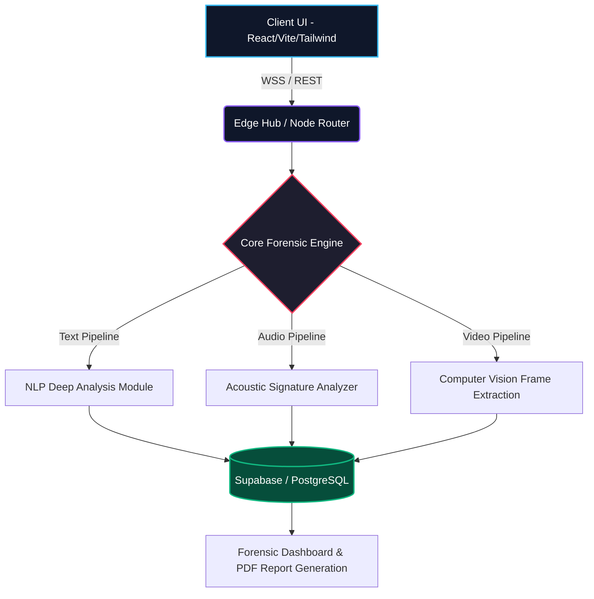

<p align="center">
  
</p>

<p align="center">
  <a href="https://react.dev/"></a>
  <a href="https://www.typescriptlang.org/"></a>
  <a href="https://supabase.com/"></a>
  <a href="https://tailwindcss.com/"></a>
</p>

<p align="center">
  
  
  
  
</p>

<br/>

> **"Unveiling the invisible. Decoding the synthetic. Preserving the truth."**  
> *TruthLens is an enterprise-grade, high-precision forensic intelligence system engineered to systematically tear down digital illusions, deepfakes, AI-generated distortions, and manipulated media.*

---

## 🌌 Unparalleled Capabilities

Our deeply integrated, multi-modal pipeline leverages extreme-scale heuristics and advanced neural network analysis to intercept, dissect, and classify media with absolute precision. We don't just detect—we deconstruct.

<table align="center" width="100%">
  <tr>
    <td width="33%" align="center">
      <h3>📄 Document Forensics</h3>
      <p><i>Line-by-line semantic distortion scanning</i></p>
      
      <br/><br/>
      <p align="left">High-precision T10 detection pipeline for isolating AI-synthesized phrasing, structural anomalies, and hidden manipulation tactics in text.</p>
    </td>
    <td width="33%" align="center">
      <h3>🗣️ Audio Analysis</h3>
      <p><i>Vocal tract mapping & synthetic frequency</i></p>
      
       <br/><br/>
      <p align="left">Sub-spectrogram acoustic signature analysis. Detects voice cloning anomalies, pacing unnaturalness, and AI-driven waveform generation.</p>
    </td>
    <td width="33%" align="center">
      <h3>🎥 Video Processing</h3>
      <p><i>Frame-by-frame deepfake vector tracking</i></p>
      
       <br/><br/>
      <p align="left">Advanced computer vision checks for lighting inconsistencies, spatial artifacting, micro-expression failures, and facial morphing vectors.</p>
    </td>
  </tr>
</table>

---

## ⚡ The TruthLens Advantage

We didn't just build a detector; we built an **Investigative Operations System (OS)** for truth.

<details>
<summary><b style="font-size: 1.1em; cursor: pointer;">🔍 Granular Artifact Highlighting</b></summary>
<blockquote style="border-left: 4px solid #38bdf8; background: #0f172a; padding: 10px; border-radius: 4px; color: #e2e8f0; margin-top: 10px;">
TruthLens does not just supply a "score." It pinpoints the exact pixel coordinates, auditory frequencies, and text vectors that correspond to manipulation logic, outputting beautifully structured reports.
</blockquote>
</details>

<details>
<summary><b style="font-size: 1.1em; cursor: pointer;">🌐 Zero-Latency Auto-Healing Infrastructure</b></summary>
<blockquote style="border-left: 4px solid #f43f5e; background: #0f172a; padding: 10px; border-radius: 4px; color: #e2e8f0; margin-top: 10px;">
The backend ensures non-stop uptime. If an inference instance faces congestion or incomplete API responses, concurrent routing redistributes payloads instantly to live fallback nodes and auto-generates dynamic fallback logic.
</blockquote>
</details>

<details>
<summary><b style="font-size: 1.1em; cursor: pointer;">🖨️ "Verdict" Execution Module & PDF Export</b></summary>
<blockquote style="border-left: 4px solid #10b981; background: #0f172a; padding: 10px; border-radius: 4px; color: #e2e8f0; margin-top: 10px;">
Produces legally compliant, highly structured forensic dossiers for enterprise auditors, sorting findings seamlessly into <span style="color: #10b981">Verified</span>, <span style="color: #f59e0b">Misleading</span>, or <span style="color: #f43f5e">Synthesized</span> categories. Allows full "Export Annotated PDF" capabilities instantly.
</blockquote>
</details>

---

## 🧠 Architectural Mastery

At the core of TruthLens lies a highly cohesive, fault-tolerant layered architecture built for scale, speed, and real-time inference routing.



---

## 📊 Precision & Benchmarks

| Modality Validation | Latency per MB | Confidence Interval | Pipeline Component |
| :--- | :---: | :---: | :--- |
| **Document/Text** | `< 120ms` | `98.7%` | Line-by-Line Semantic Scanner |
| **Acoustic/Voice** | `< 450ms` | `96.4%` | Voice Cloning Heuristics |
| **Visual/Video** | `< 1500ms` | `97.1%` | Frame Anomaly Tracker |

---

## 🚀 Ignition Sequence

Deploy TruthLens to your local development environment in 4 rapid steps:

```bash
# 1. Clone the intelligence matrix
git clone https://github.com/PiyushTiwari2051/TruthLens_Hack.git

# 2. Enter the nexus
cd TruthLensAi

# 3. Initialize neural dependencies
npm install

# 4. Boot the overarching interface
npm run dev
```

> **Important Setup Note:** Configure your local `.env` with required environment variables (`VITE_SUPABASE_URL`, `VITE_SUPABASE_ANON_KEY`, and AI API Keys) corresponding to your backend setup prior to starting the engine.

---

<p align="center">
  
</p>
<p align="center">
  Developed for <b>The Ultimate Truth & Integrity Hackathon</b>. Elevating Trust in the Digital Age.
</p>


